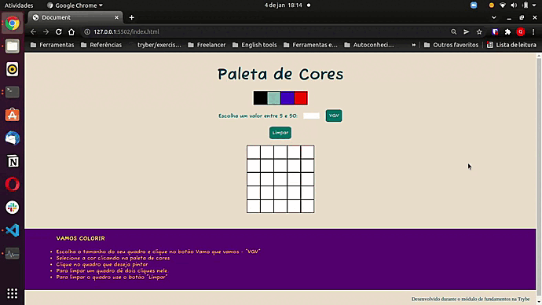

# PIXELS ART PROJECT

Project build-up in the Web Development Fundamentals Module of the [Trybe](https://www.betrybe.com/) course.
In this block I learned about `DOM`, `JavaScript`, `Eventos` and `WebStorage`.

**Objective**: web page's implementation with a color palette that permits the creation of drawings in pixels.

**Used tools:**
* JavaScript
* CSS
* HTML

`DOM` and `JavaScript` manipulation skills were worked on. I learned about `CSS selectors` , `HTML elements`, `Dom Events`.

### Project Preview

### Project Links
* [Page](https://queite.github.io/LearningProjects/PixelsArtProject/index.html)

In every [Trybe](https://www.betrybe.com/) project are employed `ESLint`, `Cypress` and `GitHub`.
