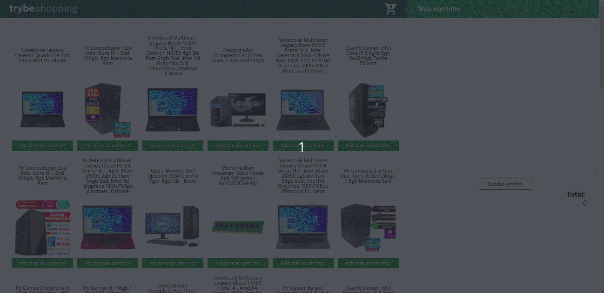

# SHOPPING CART :shopping_cart:

Project build-up in the Web Development Fundamentals Module' block of the [Trybe](https://www.betrybe.com/) course.

Construct a Dinamic shopping cart using data from an API

**Objective**: put into practice the following abilities:
* Work with API
* Apply knowledge of `JavaScript`, `CSS` e `HTML`
* Work with `asynchronous functions`
* Implement unit tests

:hammer_and_wrench:**Used tools:**
* JavaScript
* CSS
* HTML
* Jest

---

### Project Links
* [Page]()

---

### Project Preview

All [Trybe](https://www.betrybe.com/) projects use `linters`, `Cypress` `Git` and `GitHub`.
