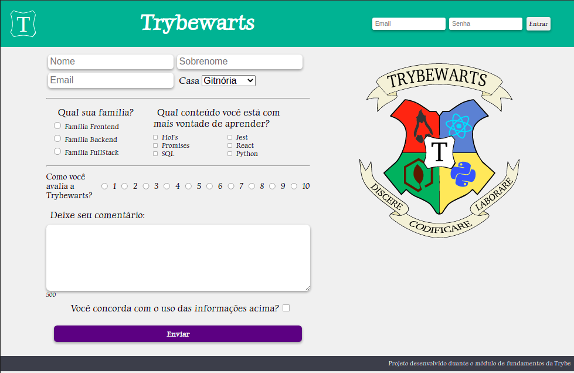

# TRYBEWARTS

Project build-up in the Web Development Fundamentals Module' block of the [Trybe](https://www.betrybe.com/) course.

**Objective**: put into practice the following abilities:
* `HTML forms` creation
* Flexible layout with `CSS FlexBox`
* Specifics CSS rules to `mobile devices`
* Building pages that change the layout according to `screen orientation`

**Used tools:**
* JavaScript
* CSS
* HTML
.
### Project Preview

### Project Links
* [Page](https://queite.github.io/projetos/PixelsArtProject/index.html)
* [Code](https://github.com/queite/queite.github.io/tree/main/projetos/PixelsArtProject)

In every [Trybe](https://www.betrybe.com/) project are employed `linters`, `Cypress` `Git` and `GitHub`.

Project created in collaboration with [Vinicius Ramalho](https://github.com/VinRamalho).
